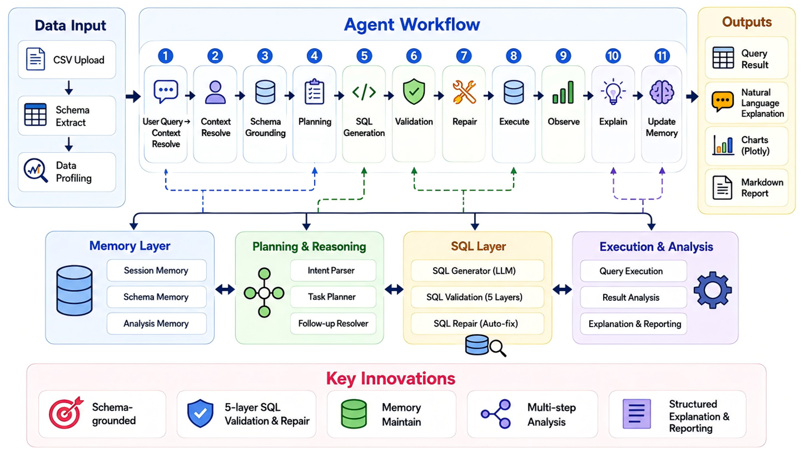

# ✨ Light Data Agent

> A lightweight, schema-grounded Data Agent for CSV-based data analysis.

Light Data Agent transforms natural language questions into **safe**, **executable**, and **explainable** data workflows. It is a compact research and engineering prototype that emphasizes agent workflow, schema grounding, SQL validation & repair, persistent memory, and multi-step analysis.

---

## 🏗️ Architecture



---

## 🎯 What Light Data Agent Does

Upload structured data, ask questions in natural language, and receive validated SQL results, explanations, charts, and reports — all within a **persistent project workspace**.

### ⚡ Single-step flow (simple questions)

```text
User Query → Context Resolve → Schema Grounding → Planning
→ SQL Generation → Validation → Repair → Execution
→ Observation → Explanation → Memory Update → Artifacts
```

### 🔗 Multi-step flow (complex goals)

```text
User Goal → Goal Decomposer → MultiStepAnalysisPlan (≤ 6 steps)
→ Step Execute → Observe → Critic → Final Synthesis → Report
```

---

## 💡 Key Innovations

### 1️⃣ Schema-grounded Analysis

The agent does not generate SQL from the user query alone. It first grounds the task in real dataset metadata — table/column names, semantic field types, aliases, sample values, and quality statistics — to reduce field hallucination.

### 2️⃣ Safe SQL Validation and Repair

Every SQL statement passes a five-layer pipeline before execution:

```text
🛡️ Policy → Syntax → Schema → Semantic → DuckDB Dry-run
```

Controlled repair handles column/table mismatches and DuckDB dialect issues; repaired SQL is re-validated before execution.

### 3️⃣ Agent Workflow with Explicit State

An explicit state machine replaces one-shot LLM → execute patterns:

- `AgentState` & workflow controller
- Step-level trace logging
- Repair and fallback control
- Observable, debuggable pipeline

### 4️⃣ Persistent Memory & Multi-turn Interaction

Structured memory spans session, project, and dataset scopes — **persisted in SQLite** across app restarts.

| Memory type | Purpose |
|-------------|---------|
| 💬 Session | Short-term follow-up context |
| 📁 Project | Common metrics, findings, preferences |
| 📊 Dataset | Schema summary, field aliases, usage stats |
| 🔍 Query | Historical questions & SQL |

Example follow-up:

```text
User: What are sales by region?
Agent: ...
User: What about profit?
→ Resolved as: Compare profit by region
```

### 5️⃣ Project Workspace

Long-running analysis projects with:

- 📂 Multiple datasets per project
- 📜 Analysis history browser
- 📎 Artifact store (SQL, charts, Markdown reports)
- 🔒 Project-isolated memory

### 6️⃣ Multi-step Analysis Plan

Complex goals automatically decompose into serial steps with dependencies, observations, and a final synthesis — e.g. *"Why did sales decrease this month?"*

```text
① Compare current vs previous month sales
② Decompose change by region
③ Decompose change by product category
④ Synthesize findings, limitations & next steps
```

---

## 📋 Core Features

| Area | Status | Description |
|------|:------:|-------------|
| Project Workspace | Done | Create/switch projects, manage datasets, view history & artifacts |
| Persistent Memory | Done | SQLite-backed memory; field aliases survive restart |
| Multi-step Analysis | Done | Goal decomposer, plan executor, final synthesizer |
| Data Input | Done | CSV upload, column normalization, schema preview |
| Schema Grounding | Done | Field roles, quality tags, aliases, cannot-answer detection |
| Planning | Done | Intent parsing, `AnalysisPlan`, follow-up suggestions |
| SQL Generation | Done | Rule-based + optional LLM, plan-driven |
| SQL Validation | Done | 5-layer validation pipeline |
| SQL Repair | Done | Auto-fix column/table/dialect errors |
| Execution | Done | DuckDB in-memory engine |
| Observation | Done | Result summary, data quality, contribution analysis |
| Visualization | Done | ChartSpec + Plotly rendering |
| Reporting | Done | Markdown export linked to project artifacts |
| Safety | Done | Read-only policy, sensitive masking, prompt guard |
| Tests | Done | Unit & E2E over `sample_data/sales.csv` |

---

## 🔄 Agent Workflow

Central design principle:

> **LLM proposes · System verifies · Engine executes · Observation grounds explanation · Memory maintains context**

```text
 1. Receive user query
 2. Resolve context from memory (session + project)
 3. Retrieve and ground schema
 4. Route: single-step OR multi-step plan
 5. Parse intent / decompose goal
 6. Generate analysis plan
 7. Generate candidate SQL per step
 8. Validate SQL (5 layers)
 9. Repair SQL if needed
10. Execute validated SQL
11. Observe, summarize, critique results
12. Generate explanation and chart
13. Update memory, save artifacts & analysis record
```

---

## 📁 Project Structure

```text
app.py                     Streamlit entry

core/                      agent, workflow, state, trace, config
workspace/                 project manager, dataset registry, artifacts
persistence/               SQLite store & repositories
multi_step/                goal decomposer, plan executor, synthesizer
memory/                    session, project, schema, query, analysis memory
schema_grounding/          schema extraction, aliases, field selection
planning/                  intent parser, task planner, analysis plan
sql_layer/                 SQL generation, validation, repair, execution
observation/               data quality, contribution analysis, insights
visualization/             chart spec & Plotly renderer
reporting/                 Markdown report builder
safety/                    read-only policy, masking, prompt guard
llm/                       optional OpenAI client
ui/                        workspace, memory, plan, artifact panels
storage/                   SQLite DB + project files (persistent)
doc/                       architecture figures
sample_data/               demo datasets
tests/                     unit and end-to-end tests
```

---

## 🚀 Quick Start

**macOS / Linux**

```bash
python -m venv .venv
source .venv/bin/activate
pip install -r requirements.txt
cp .env.example .env
streamlit run app.py
```

**Windows**

```bash
python -m venv .venv
.venv\Scripts\activate
pip install -r requirements.txt
copy .env.example .env
streamlit run app.py
```

On first launch a **Default Project** is created automatically. Data and analysis history persist under `storage/`.

---

## 🤖 Optional LLM Setup

The system runs **without an API key** using rule-based SQL fallback.

```env
OPENAI_API_KEY=your_api_key_here
LLM_MODEL=gpt-4o-mini
```

Key settings (see `.env.example`):

```env
ENABLE_PROJECT_WORKSPACE=true
ENABLE_PERSISTENT_MEMORY=true
ENABLE_MULTI_STEP_PLAN=true
MAX_PLAN_STEPS=6
```

Do not commit `.env` to version control.

---

## 💬 Example Questions

**Single-step**

```text
What is the monthly sales trend?
Which region has the highest sales?
What is the average profit by product category?
Show the top 5 product categories by sales.
Are there missing values in the dataset?
```

**Multi-turn follow-ups**

```text
What are sales by region?
What about profit?
Change the analysis to product category.
Show only the East region.
```

**Multi-step (complex goals)**

```text
Why did sales decrease this month?
Give me an overview of this dataset.
Run a full data quality diagnosis.
Generate a Markdown report.
```

---